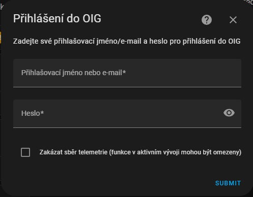
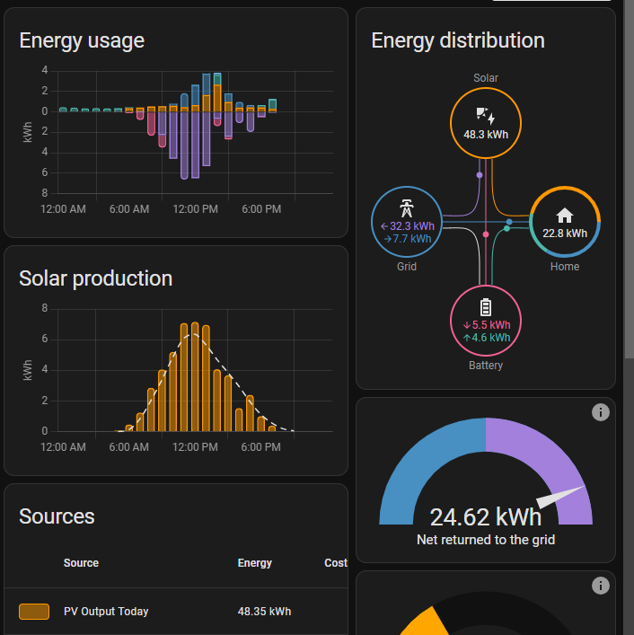

---
# OIG Cloud Integrace pro Home Assistant
Tato integrace umožňuje propojení Čez Battery Box s Home Assistantem skrze OIG Cloud. Poskytuje základní informace o stavu baterie, výroby, spotřeby a historických dat. Obsahuje také potřebné entity pro použití stránky Energie a umožňuje také nastavit pracovní režim boxu a regulovat přetoky do distribuční sítě.

## Instalace
Nejjednodušší způsob instalace je přes [HACS](https://hacs.xyz/). V nastavení HACS zvolte "Integrations" a vyhledejte "OIG Cloud". Po instalaci je nutné restartovat Home Assistant.

## Konfigurace
Při konfiguraci je třeba zadat přihlašovací údaje do OIG Cloudu (stejné jako pro mobilní aplikaci). Volitelně lze také zakázat odesílání anonymní telemetrie.

## Použití
Po instalaci a konfiguraci se vytvoří nové zařízení a entity. Všechny entity jsou dostupné v entitním registru a lze je tak přidat do UI. K aktualizaci dat dochází každou minutu.

## Energie
Integrace obsahuje statistické entity, které lze přímo využít v panelu Energie. Jde o položky:
- Dnešní odběr ze sítě
- Dnešní dodávka do sítě
- Dnešní výroba
- Dnešní nabíjení baterie
- Dnešní vybíjení baterie

